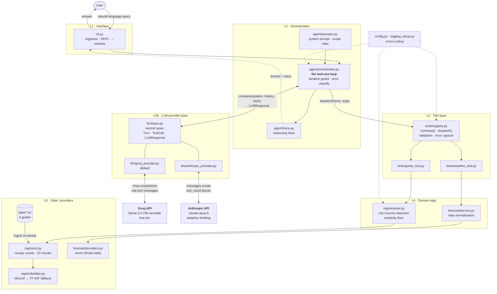
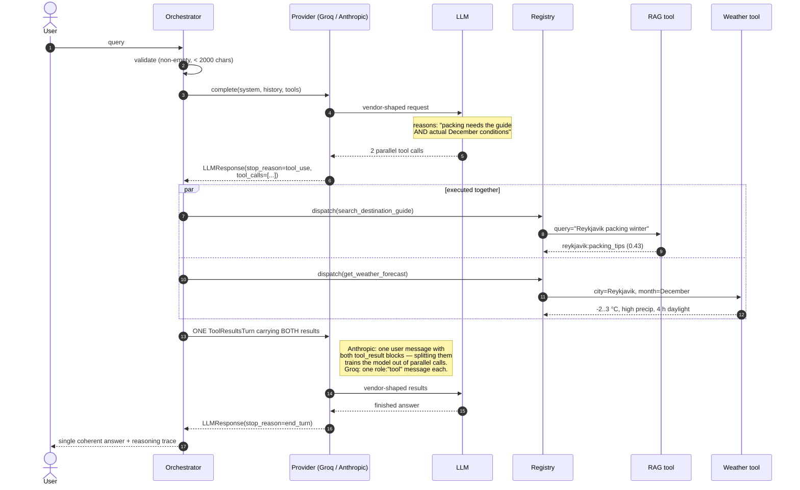

# TripMate Architecture

## Component diagram

**Dependency rule:** arrows point downward only. L2 imports L3; L3 imports L4;
L4 imports L5. Nothing imports upward.

Two seams do the load-bearing work:

- **`registry.specs()` / `registry.dispatch()`** — the orchestrator's entire
  view of the tool layer. It has no travel knowledge, so adding a third tool
  requires no change to it.
- **`LLMProvider.complete()`** — the orchestrator's entire view of the vendor.
  It never sees an Anthropic content block or an OpenAI `tool_calls` array, so
  switching vendors is a one-file change and the 109 tests are unaffected.

## Request flow — the multi-tool case

`"What should I pack for Reykjavik in December?"`

## Where each failure is handled

Failures are pushed **down**, never up. A tool that raises would kill the loop;
a tool that returns `tool_result(is_error=True)` lets the model recover.

| Failure | Layer | Behaviour |
|---|---|---|
| Empty / malformed / over-long input | L1–L2 | Rejected before any API call |
| Unknown destination | L4 retriever | Zero vocabulary overlap → no results → model names its actual coverage |
| Missing weather data | L4 service | `{"available": false, "reason": "unsupported_city"}` |
| Season instead of a month | L4 service | `unparseable_date` → model asks which month |
| Tool raises / times out | L3 registry | Caught → `is_error` result → loop continues |
| Unknown tool name | L3 registry | Error result listing valid tools |
| Malformed tool-call JSON from the model | L2b provider | Parsed defensively → empty args → registry rejects with a usable message |
| Provider down / rate-limited | L2b → L2 | `describe_error()` classifies most-specific-first → graceful message |
| Unknown provider / missing SDK | L2b factory | `ProviderError` at startup, naming the fix |
| Model loops without settling | L2 | `max_iterations` guard |
| Out-of-scope request | L2 prompt | No tool exists → the model says so |
